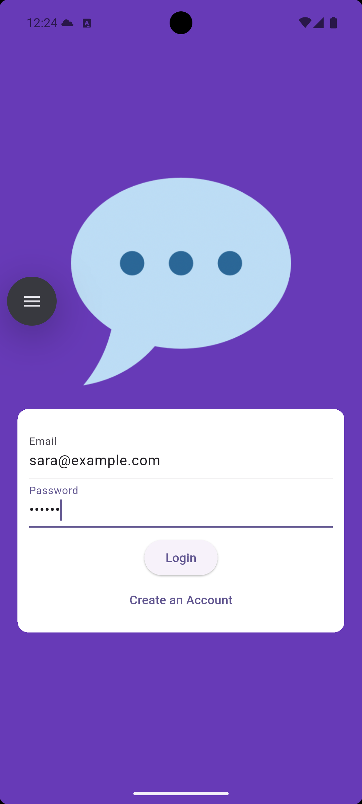

# Flutter Public Chat App

A simple **public group chat application** built with **Flutter** and **Firebase**. All users chat together in one shared room (no private chats).

---

## ✨ Features

* 🔐 Firebase Authentication (Email/Password)
* 💬 One public chat room (all users see the same messages)
* 🧑 User avatars stored in Firebase Storage
* ⚡ Real-time messages with Cloud Firestore
* 📱 Clean and simple Flutter UI
---

## 📸 Screenshots

  
  
  

